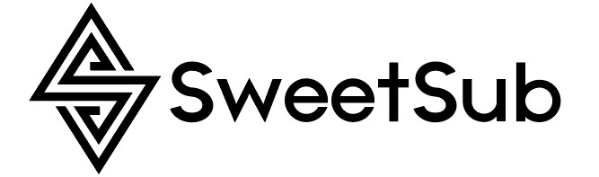

  

欢迎关注 SweetSub 的 [telegram 频道](https://t.me/SweetSub)

# 作品一览表

下载字幕以及查看 SweetSub 既往作品
## [请点击此处](https://docs.google.com/spreadsheets/d/1Gvauymesdv5fhJX3RzOxA4A9i_B6qZXALVArEonjMIY/edit?usp=sharing)

--- 

### 關於繁化

- 除了 **Flip Flappers** 和**魔法紀錄：魔法少女小圓外傳**以外，SweetSub 的繁體字幕均是採用[繁化姬](https://zhconvert.org/)程序自動台灣化，**未**進行人工核查，歡迎有有意幫助繁化的人士提出 [issue](https://github.com/SweetSub/SweetSub/Archive/issues) 或是給出 pull request。

- 在作品一覽表中未標記為“BD 合集”的作品是半成品，很有可能在精校時有各種修改，因此，請等待其狀態變成“BD 合集”之后再進行人工繁化。

## 转载及再利用说明

SweetSub 的字幕在二次使用时默认遵从<a rel="license" href="http://creativecommons.org/licenses/by-nc-nd/4.0/">知识共享署名-非商业性使用-禁止演绎 4.0 国际许可协议</a> （Creative Common BY-NC-ND 4.0） ，在遵循规则的情况下可以自由转载、使用。

但是，对于调整时间轴用于匹配自己的不同片源的小伙伴，可以例外在署名、非商业使用的情况下，调整时间轴，自由转载、使用。

#### 详细解释

###### 名词解释

- 署名

  - 在转载和使用时，明确清晰地指出是 SweetSub 的字幕（不要使用比发布帖正文更小的字体），同时保留在字幕文件中的字幕制作人员信息。
  - 例子 1：字幕由 SweetSub 提供。
  - 例子 2：字幕源自 SweetSub，经调轴后内封在视频里。

- 调整时间轴

  - 在调整时间轴时最好不要仅使用 [sushi](https://github.com/tp7/Sushi) 调轴，因为 SweetSub 的字幕中包含很多屏幕字，这些屏幕字都是以帧为单位对齐画面的。sushi 的调轴基于音频，所以画面字不一定能对齐，需要手工调整——我知道大家觉得这麻烦，因此 SweetSub 的字幕在动画出了 BD 版之后，都**一定**会发布一个 BD 版的字幕。

###### 详细说明

- 在署名、非商业使用、没有修改的情况下可以随意的转载和使用 SweetSub 的字幕。
  - 如果发现字幕有错误，想要修改，请通过 [telegram](https://t.me/tastysugar) 联系我，或者发 [issue](https://github.com/SweetSub/SweetSub/issues)。

- 压制组可以在署名、非商业使用的情况下，随意附带本组的字幕，并且自行调整时间轴和画面字匹配片源发布。可以参见下面的用例，如果仍有疑问，欢迎联系我。

- 如果对字幕做了协议所允许之外的修改，请不要对外公开发布，留着自己私下使用就好。

- SweetSub 会在连载结束、合集、或者是 BD 发布后重新精校字幕，届时会修正字幕文件。如果要转载、使用未合集时的字幕，请务必注意这一点。

###### 用例

允许的行为：
- 转载分享字幕文件。
- 转载分享 SweetSub 发布的一切成品，外挂、内嵌、或内挂视频。
- 以外挂字幕文件的形式，和你自己的视频文件一起发布。
- 把 SweetSub 的字幕文件以原本的形式混流进你自己的视频文件一起发布。
- 在进行以上行为时，调整字幕的时间轴以匹配视频文件。
- 在进行以上行为时，对字幕进行 crop 操作以匹配视频文件的黑边。

以下行为如有需求请先联系我：
- 分享经过了除调整时间轴和 crop 以外的修改后的字幕文件。
- 将字幕转换形式分享，例：转换成 SRT 格式、转换成图形字幕、制作外挂结构等。
- 将字幕压制进视频中，以内嵌的形式分享。

以下行为严格禁止：
- 把字幕用于商业或盈利目的。
- 在转载、分享之后不署名。
- 宣称该字幕是由其他人物或团体所制作。
- 误导观众，使他们认为该字幕是由其他人物或团体所制作

###### 其它说明

- 如果有什么特殊需求想要在以上规则以外使用、修改、发布字幕的，请通过 [telegram](https://t.me/tastysugar) 联系我，或者也可以发 issue。欢迎与我商议。
- 以上规则自 2024 年 8 月 25 日起适用。

